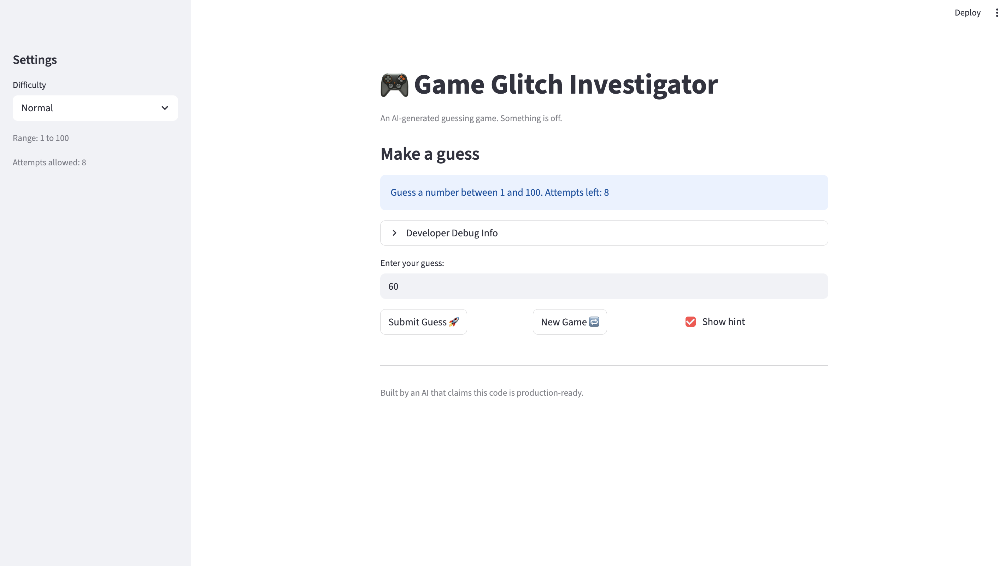

# 🎮 Game Glitch Investigator: The Impossible Guesser

## 🚨 The Situation

You asked an AI to build a simple "Number Guessing Game" using Streamlit.
It wrote the code, ran away, and now the game is unplayable. 

- You can't win.
- The hints lie to you.
- The secret number seems to have commitment issues.

## 🛠️ Setup

1. Install dependencies: `pip install -r requirements.txt`
2. Run the broken app: `python -m streamlit run app.py`

## 🕵️‍♂️ Your Mission

1. **Play the game.** Open the "Developer Debug Info" tab in the app to see the secret number. Try to win.
2. **Find the State Bug.** Why does the secret number change every time you click "Submit"? Ask ChatGPT: *"How do I keep a variable from resetting in Streamlit when I click a button?"*
3. **Fix the Logic.** The hints ("Higher/Lower") are wrong. Fix them.
4. **Refactor & Test.** - Move the logic into `logic_utils.py`.
   - Run `pytest` in your terminal.
   - Keep fixing until all tests pass!

## 📝 Document Your Experience

- [ ] Describe the game's purpose.
The purpose of the game is to provide a number-guessing experience where the player attempts to guess a randomly generated secret number within a limited number of attempts. The game includes hints to guide the player, such as "Go Higher" or "Go Lower," based on their guesses. It also allows players to select difficulty levels, which adjust the range of numbers and the number of attempts allowed.

- [ ] Detail which bugs you found.

1. Inconsistent Hint Logic: The hints provided were sometimes incorrect due to alternating between string and integer comparisons for the secret number.
1. Contradictory Hints for the Same Input: The same guess could produce different hints depending on the attempt number.
1. New Game Button Did Not Reset State: The "New Game" button did not reset the game state properly, causing the game to freeze or display incorrect messages.
1. Premature "Out of Attempts!" Message: The game ended one attempt too early, displaying "Out of attempts!" with one attempt still remaining.
1. Incorrect Scoring Logic: The scoring system deducted points incorrectly for wins, awarding only 90 points for a win on the first attempt instead of 100.

- [ ] Explain what fixes you applied.
1. Inconsistent Hint Logic: Removed the alternating logic for the secret number and ensured it is always treated as an integer.
1. Contradictory Hints for the Same Input: Centralized the hint logic in the check_guess function to ensure consistent behavior.
1. New Game Button Did Not Reset State: Reset the game state variables (status, history, etc.) when the "New Game" button is clicked.
1. Premature "Out of Attempts!" Message: Adjusted the logic to check for remaining attempts before incrementing the attempt counter.
1. Incorrect Scoring Logic: Fixed the formula in the update_score function to correctly calculate points for a win, awarding 100 points for a win on the first attempt.

## 📸 Demo

- [ ] [Insert a screenshot of your fixed, winning game here]

## 🚀 Stretch Features

- [ ] [If you choose to complete Challenge 4, insert a screenshot of your Enhanced Game UI here]
